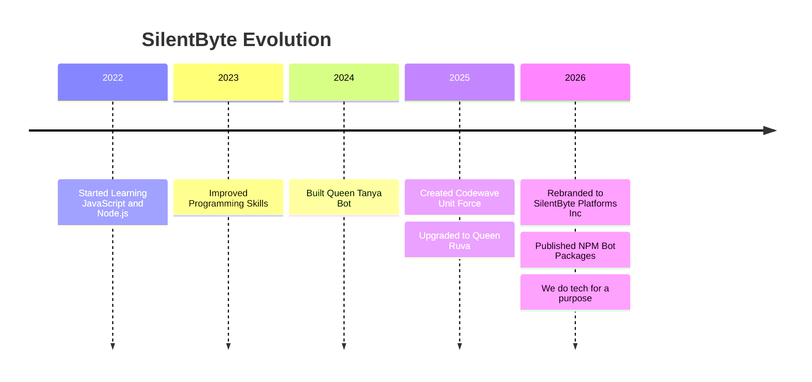

<!-- Animated Header Wave - Purple Gradient Theme -->

  

<!-- Animated Typing Introduction -->

  

<!-- Profile Views Counter -->

  

<!-- Powered By Badge -->

  
  
  

  

<!-- Connect Section -->

  <h2>
     
    Connect With Me 
    
  </h2>

  
  
  
  
  

 

<!-- GitHub Widget Box -->

  

  

<!-- About Me Section -->
<h2 align="center">🧑‍💻 About Me</h2>

<table align="center">
  <tr>
    <td align="center" width="50%">
      
        
      <b>Name:</b> Iconic Tech 
      <b>Started Coding:</b> 2022 
      <b>Favorite Language:</b> JavaScript 
      <b>Focus:</b> Bots, NPM Packages & Backend
    </td>
    <td align="center" width="50%">
      
        
      <b>Brand Founded:</b> 2026 
      <b>Previous:</b> Codewave Unit Force (2025) 
      <b>Legacy:</b> Queen Tanya → Queen Ruva 
      <b>Mission:</b> "We do tech for a purpose"
    </td>
  </tr>
</table>

  

<!-- What I Do -->
<h2 align="center">⚡ What I Do</h2>

| 📦 NPM Packages | 🤖 Bot Development | 🌐 Web Development | 🛠️ Backend |
|:---:|:---:|:---:|:---:|
| Publish useful bot libraries | WhatsApp Bots (Baileys) | Modern UI/UX | API Development |
| Open source tools | Custom Bot Scripts | Mobile-Friendly Sites | Database Management |
| Bot utility modules | Bot Hosting & Selling | Clean Code | Server Config |
| Socket handlers | Queen Ruva Bot | Responsive Design | Domain Support |

  

<!-- Tech Stack -->
<h2 align="center">🛠️ Tech Stack & Tools</h2>

  
  
  
    
  
  
  
  
  
  
  
  
  
  
  

 

<!-- GitHub Stats -->
<h2 align="center">📊 GitHub Statistics</h2>

  
  
  
  
  

 

  

 

<!-- Contribution Graph -->
<h2 align="center">📈 Contribution Activity</h2>

  

 

<!-- Trophies -->
<h2 align="center">🏆 GitHub Trophies</h2>

  

 

<!-- Journey Timeline -->
<h2 align="center">🚀 My Journey</h2>

 

<!-- Snake Animation -->

  <h2>🐍 Contribution Snake</h2>
  

 

<!-- Animated Quote -->

  

 

<!-- Footer Typing -->

  

<!-- Footer Wave -->

  

<!--
SilentByte Platforms, Iconic Tech, Zimbabwe Developer, WhatsApp Bot Developer,
JavaScript Developer, Node.js Developer, NPM Publisher, Bot Library Developer,
Baileys Bot Developer, Full Stack Developer, Queen Ruva Bot, Codewave Unit Force,
iconictech-dev, SilentByte Platforms Inc, Zimbabwe Tech, Open Source
-->
